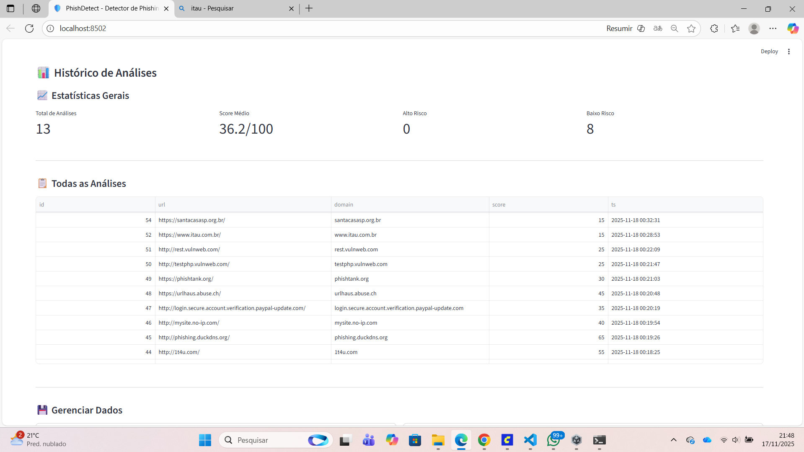
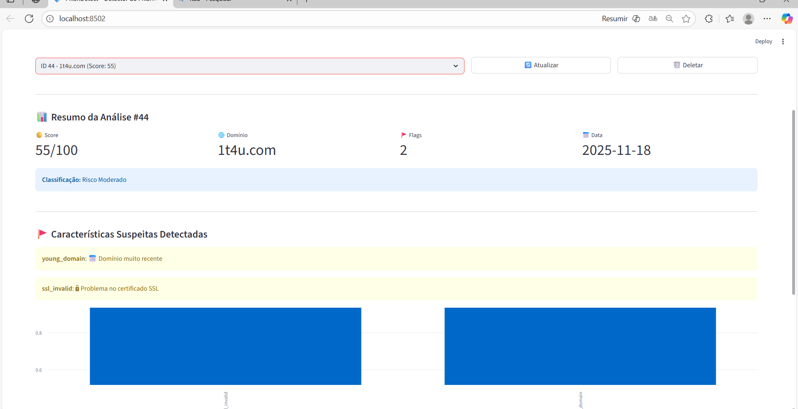
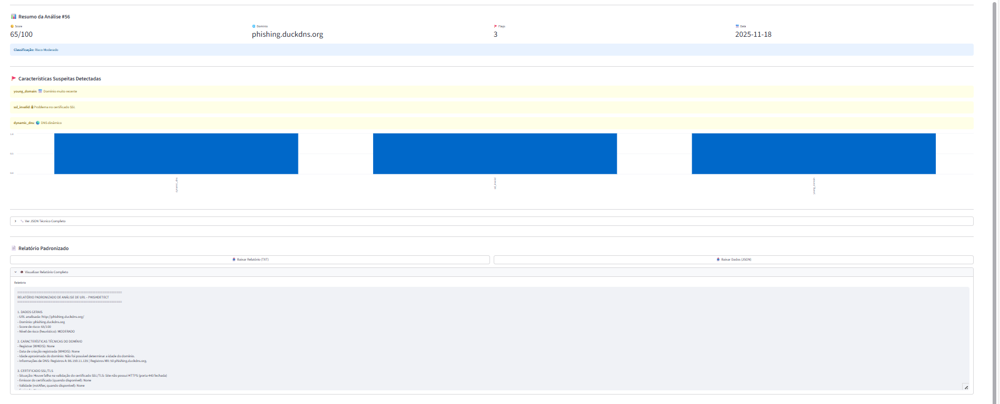

# PhishDetect 

https://youtu.be/adp7IK1lj5k

Implementação mínima para a Opção 3 (Conceito B) — ferramenta de detecção/análise de phishing.

## Requisitos
- Python 3.11+
- pip

## Instalação
1. python -m venv venv
2. source venv/bin/activate
3. pip install -r requirements.txt

## Rodar local (modo rápido)
1. uvicorn app.main:app --reload
2. streamlit run app/ui_streamlit.py

A API estará em http://127.0.0.1:8000
O frontend (Streamlit) estará em http://127.0.0.1:8501

## Rodar com Docker
docker build -t phishdetect-b .
docker run -p 8000:8000 -p 8501:8501 phishdetect-b

---

## Relatório Técnico - PhishDetect

### 1. Introdução
**PhishDetect** é uma ferramenta de detecção e análise de URLs suspeitas de phishing, desenvolvida para o TechHack 2025 (Insper, Semestre 7). O sistema implementa análise heurística avançada combinando múltiplas técnicas de verificação, oferecendo uma interface web interativa para análise e acompanhamento de URLs.

**Objetivo:** Identificar características suspeitas em URLs que podem indicar tentativas de phishing, auxiliando usuários a verificar a legitimidade de sites antes de inserir informações sensíveis.

**Tecnologias:** Python 3.12, FastAPI, Streamlit, SQLite, python-whois, BeautifulSoup4, RapidFuzz

---

### 2. Arquitetura do Sistema

#### 2.1 Componentes Principais

**Backend (FastAPI):**
- Endpoint `POST /analyze`: Recebe URL e retorna análise completa
- Endpoint `GET /health`: Verificação de status da API
- Porta padrão: 8000

**Frontend (Streamlit):**
- Interface com 3 abas: Nova Análise, Histórico, Relatórios Detalhados
- Visualização interativa com blocos de testes visuais (Pass/Fail/Warning)
- Porta padrão: 8502

**Banco de Dados (SQLite):**
- Arquivo: `phish_history.db`
- Tabela `history`: armazena histórico de análises
- Campos: id, url, domain, score, flags, raw (JSON), timestamp

#### 2.2 Fluxo de Análise
1. Usuário insere URL na interface Streamlit
2. Frontend envia requisição POST para API FastAPI
3. Backend executa bateria de testes heurísticos
4. Resultado é pontuado e armazenado no banco
5. Frontend exibe análise detalhada com indicadores visuais

---

### 3. Funcionalidades Implementadas

#### 3.1 Verificações do Conceito C (Básicas)
**Blacklist de Domínios Conhecidos**
- Verificação contra lista de domínios maliciosos conhecidos
- Pontuação: +100 pontos se encontrado

**Detecção de Padrões Suspeitos**
- **Leet Speak:** Substituição de letras por números (g00gle, fac3book)
- **Subdomínios Excessivos:** Mais de 3 subdomínios (login.secure.paypal.verification.com)
- **Caracteres Especiais:** Hífens, underscores em excesso
- Pontuação: +15 pontos por padrão detectado

#### 3.2 Análise Heurística Avançada (Conceito B)

**Análise de Idade do Domínio (WHOIS)**
- Consulta via biblioteca `python-whois` com retry logic
- Domínios com menos de 1 ano são considerados suspeitos
- Tratamento de timezones e múltiplos formatos de data
- Timeout: 10 segundos por tentativa, 2 tentativas
- Pontuação: +30 pontos se domínio jovem (<365 dias)

**Verificação de DNS Dinâmico**
- Detecção de serviços como no-ip.com, dyndns.org, ddns.net
- Domínios dinâmicos são comuns em ataques temporários
- Pontuação: +20 pontos se detectado

**Análise de Certificados SSL**
- Verificação de disponibilidade de HTTPS
- Validação de certificado (emissor, expiração, domínio)
- Fallback com SSL context permissivo para sites problemáticos
- Port check preventivo (5s) antes da conexão SSL
- Timeout: 15 segundos
- Pontuação: +25 pontos se SSL inválido/ausente

**Detecção de Redirecionamentos Suspeitos**
- Acompanhamento de cadeia de redirecionamentos HTTP
- Mais de 3 redirecionamentos é considerado suspeito
- Pontuação: +10 pontos

**Similaridade com Domínios Conhecidos (Levenshtein)**
- Comparação com lista de marcas conhecidas (google, facebook, amazon, etc.)
- Usa algoritmo de distância de Levenshtein via RapidFuzz
- Threshold: similaridade > 70% mas não 100% (typosquatting)
- Exemplos: g00gle.com, faceb00k.com, arnaz0n.com
- Pontuação: +35 pontos

**Análise de Conteúdo HTML**
- Download e parsing do HTML com BeautifulSoup4
- Detecção de formulários de login (campos password/email)
- Identificação de solicitações de informações sensíveis (CPF, cartão, CVV)
- Busca por logos de marcas conhecidas sem correspondência de domínio
- Pontuação: +15 pontos por categoria detectada

---

### 4. Interface Web Interativa

#### 4.1 Aba "Nova Análise"
- Campo de entrada para URL
- Botão "Analisar URL"
- **Blocos de Teste Visuais:**
  - Verde: Teste passou (seguro)
  - Vermelho: Teste falhou (suspeito)
  - Amarelo: Aviso/timeout
  - Azul: Informação adicional
- Seções expandíveis para cada categoria de teste
- Score final em destaque com interpretação
- Botões de download: TXT e JSON

#### 4.2 Aba "Histórico"
- **Estatísticas Globais:**
  - Total de análises realizadas
  - Score médio
  - URLs únicas analisadas
- **Gráfico de Distribuição de Flags:**
  - Visualização em barras das características mais detectadas
- **Tabela de Histórico:**
  - Todas as análises com ID, URL, domínio, score, timestamp
  - Ordenação e filtragem disponíveis
- **Exportação:**
  - Botão para download do histórico em CSV
  - Botão "Limpar Todo Histórico" com confirmação

#### 4.3 Aba "Relatórios Detalhados"
- Seleção de análise por ID com prévia (domínio + score)
- Visualização completa da análise selecionada
- Downloads individuais (TXT/JSON)
- Botão "Deletar" para remover análise específica
- Botão "Atualizar" para refresh da lista

---

### 5. Sistema de Pontuação

O score é calculado somando pontos de cada flag detectada:

| Flag | Pontos | Descrição |
|------|--------|-----------|
| `blacklist` | +100 | Domínio em lista de phishing conhecida |
| `young_domain` | +30 | Domínio registrado há menos de 1 ano |
| `typosquatting` | +35 | Similaridade com marca conhecida (70-99%) |
| `ssl_invalid` | +25 | Certificado SSL inválido ou ausente |
| `dynamic_dns` | +20 | Uso de serviço DNS dinâmico |
| `suspicious_pattern` | +15 | Leet speak, subdomínios excessivos, etc. |
| `has_login_form` | +15 | Formulário de login detectado |
| `requests_sensitive_info` | +15 | Solicita dados sensíveis |
| `brand_logo_mismatch` | +15 | Logo de marca sem correspondência |
| `too_many_redirects` | +10 | Mais de 3 redirecionamentos |

**Interpretação:**
- **0-20:** Provavelmente seguro
- **21-50:** Baixo risco
- **51-80:** Risco moderado
- **81-120:** Alto risco
- **120+:** Muito suspeito

---

### 6. Desafios Técnicos e Soluções

#### 7.1 WHOIS Timeout
**Problema:** Consultas WHOIS travavam ou retornavam erros de timezone.

**Solução:**
- Implementado retry logic (2 tentativas, 10s cada)
- Remoção de timezone info antes de cálculos de data (`dt.replace(tzinfo=None)`)
- Parsing de múltiplos formatos de data
- Socket timeout configurado globalmente

#### 7.2 SSL Verification
**Problema:** Sites com certificados problemáticos causavam timeout de 3+ minutos.

**Solução:**
- Port check preventivo (5s) antes da conexão SSL
- Tentativa com SSL context estrito, fallback para permissivo (CERT_NONE)
- Timeout reduzido para 15 segundos
- Mensagens informativas sobre o tipo de falha

#### 7.3 Port Conflicts
**Problema:** Porta 8000 já em uso por processos anteriores.

**Solução:**
- Comando `netstat -ano | findstr :8000` para identificar PID
- `taskkill /PID <id> /F` para liberar porta
- Documentado no README para troubleshooting

---

### 7. Checklist de Requisitos (Conceito B)

#### Análise Heurística Avançada
- Todas as verificações do conceito C
- Análise de idade do domínio (WHOIS)
- Verificação de DNS dinâmico
- Análise de certificados SSL
- Detecção de redirecionamentos suspeitos
- Similaridade com domínios conhecidos (Levenshtein)
- Análise de conteúdo (formulários + info sensível)

#### Interface Web Interativa
- Dashboard com resultados detalhados
- Histórico de URLs com exportação (CSV)
- Gráficos de distribuição de flags
- Explicações sobre cada característica
- Blocos visuais com indicadores de status

**Total: 11/11 requisitos atendidos**

**Evidências visuais disponíveis em:** [Seção 10 - Evidências Visuais](#10-evidências-visuais)

---

### 8. Estrutura de Arquivos

```
phishDetect/
├── app/
│   ├── __init__.py
│   ├── main.py              # API FastAPI
│   ├── analysis.py          # Lógica de análise heurística
│   ├── models.py            # Modelos Pydantic
│   ├── db.py                # Operações SQLite
│   └── ui_streamlit.py      # Interface Streamlit
├── tests/
│   └── test_analysis.py     # Testes unitários
├── docker-compose.yml
├── Dockerfile
├── requirements.txt
├── README.md
└── phish_history.db         # Banco SQLite (gerado em runtime)
```

---

### 9. Como Executar

#### Instalação
```bash
python -m venv venv
.\venv\Scripts\Activate.ps1  # Windows PowerShell
pip install -r requirements.txt
```

#### Execução Local
```bash
# Terminal 1: Backend
uvicorn app.main:app --reload --port 8000

# Terminal 2: Frontend
streamlit run app/ui_streamlit.py --server.port 8502
```

Acesse: http://localhost:8502

#### Docker
```bash
docker build -t phishdetect-b .
docker run -p 8000:8000 -p 8502:8502 phishdetect-b
```

---

### 10. Evidências Visuais

#### 11.1 Interface Principal - Nova Análise

*Tela de análise com blocos visuais mostrando resultados detalhados de cada teste*

#### 11.2 Histórico de Análises

*Dashboard com estatísticas globais, gráfico de distribuição de flags e histórico completo*

#### 11.3 Gráfico de Distribuição

*Visualização da frequência de cada tipo de flag detectada nas análises*

#### 11.4 Relatórios Detalhados

*Seleção e visualização de análises específicas por ID com opções de download*

---

### 11. Conclusão

O **PhishDetect** atende todos os requisitos do Conceito B, implementando análise heurística avançada com 11 tipos de verificações diferentes e uma interface web interativa completa. O sistema é robusto, com tratamento de erros e timeouts, e oferece uma experiência de usuário clara através de indicadores visuais e relatórios detalhados.

**Principais Destaques:**
- Sistema de pontuação ponderado e interpretável
- Interface intuitiva com 3 abas especializadas
- Histórico persistente com exportação
- Blocos de teste visuais com feedback imediato
- Robustez contra timeouts e certificados problemáticos

**Repositório:** https://github.com/marinnagc/phishDetect  
**Vídeo Demonstração:** https://youtu.be/adp7IK1lj5k  
**Autora:** Marina Galdino Costa  
**Disciplina:** TechHack 2025 - Insper, Semestre 7  
**Data:** 17 de novembro de 2025

---

### 12. Anexos

#### Arquivos de Evidência Incluídos:
- `images/image1.png`: Interface de Nova Análise com blocos visuais
- `images/image2.png`: Dashboard do Histórico com estatísticas
- `images/image3.png`: Gráfico de distribuição de flags
- `images/image4.png`: Tela de Relatórios Detalhados
- `phish_history.csv`: Exportação do histórico completo (gerado em runtime)
- `phishdetect_relatorio_id_56.txt`: **Exemplo de relatório gerado automaticamente pelo sistema**
- Relatórios individuais em TXT/JSON disponíveis via interface de download

#### Exemplo de Relatório Automático (phishdetect_relatorio_id_56.txt):

```
============================================================
RELATÓRIO PADRONIZADO DE ANÁLISE DE URL - PHISHDETECT
============================================================

1. DADOS GERAIS
- URL analisada: http://phishing.duckdns.org/
- Domínio: phishing.duckdns.org
- Score de risco: 65/100
- Nível de risco (heurístico): MODERADO

2. CARACTERÍSTICAS TÉCNICAS DO DOMÍNIO
- Registrar (WHOIS): None
- Data de criação registrada (WHOIS): None
- Idade aproximada do domínio: Não foi possível determinar a idade do domínio.
- Informações de DNS: Registros A: 86.159.11.135 | Registros MX: 50 phishing.duckdns.org.

3. CERTIFICADO SSL/TLS
- Situação: Houve falha na validação do certificado SSL/TLS: Site não possui HTTPS (porta 443 fechada)
- Emissor do certificado (quando disponível): None
- Validade (notAfter, quando disponível): None
- Expirado: None
- Coincidência de hostname no certificado: None

4. REDIRECIONAMENTOS
- Cadeia de redirecionamentos (URL final é o último elemento): []
- Resumo: Nenhum redirecionamento adicional foi identificado.

5. ANÁLISE DE CONTEÚDO E FORMULÁRIOS
- Quantidade de formulários = 0
- Detalhes: Não foram encontrados formulários na página analisada.

6. SIMILARIDADE COM MARCAS CONHECIDAS
- Resultado: Não foram encontradas similaridades significativas com domínios de marcas conhecidas.

7. CARACTERÍSTICAS SUSPEITAS (FLAGS)
- Flags detectadas:
  - young_domain: Domínio recente (ou sem dados WHOIS confiáveis), o que aumenta o risco.
  - ssl_invalid: Problema na verificação do certificado SSL/TLS (inválido, ausente ou erro na conexão).
  - dynamic_dns: Domínio aparenta usar serviço de DNS dinâmico (no-ip, dyndns), comum em cenários maliciosos.

8. AVALIAÇÃO GERAL E RECOMENDAÇÕES
Com base nas heurísticas implementadas (idade do domínio, SSL, redirecionamentos,
presença de formulários sensíveis, similaridade com marcas e listas de reputação),
o score de risco calculado foi de 65/100, resultando no nível de risco: MODERADO.

Recomendações:
- Recomenda-se cautela ao acessar esta URL, validação adicional por equipe de segurança 
e monitoramento de novos acessos ou alterações no domínio.
```

**Fim do Relatório**
